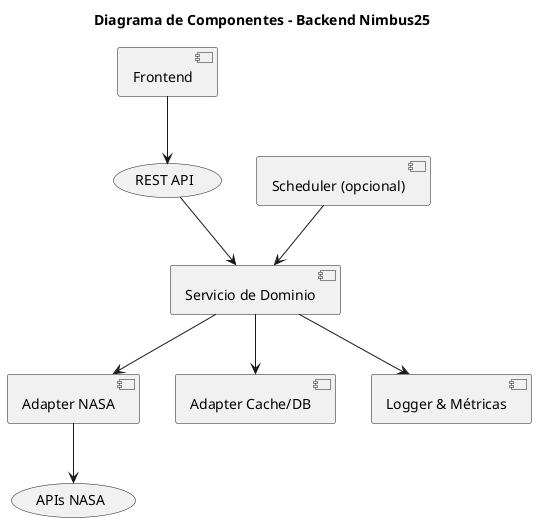

# 🧱 Componentes del Sistema – Proyecto Nimbus25  
### Desafío: *Will It Rain On My Parade?* – NASA Space Apps Challenge 2025

---

## 🧩 Propósito del documento

Describir la estructura interna del backend y los componentes principales que conforman el sistema Nimbus25, explicando su responsabilidad, dependencias y forma de interacción.

---

## 🧠 Visión general

El backend de Nimbus25 sigue un enfoque **monolito modular**, basado en los principios de **arquitectura hexagonal (puertos y adaptadores)**.  
Esto permite mantener la lógica de negocio independiente de los detalles técnicos y facilita la futura transición hacia una arquitectura de microservicios.

---

## 🧰 Módulos principales

| Módulo | Descripción | Ejemplos de funciones |
|--------|--------------|-----------------------|
| **API Layer** | Gestiona las solicitudes HTTP provenientes del frontend. Expone endpoints REST, valida parámetros y formatea las respuestas. | `/probability`, `/status`, `/health`, `/history` |
| **Domain Layer** | Contiene la lógica central del sistema: procesamiento, merge y cálculo estadístico. No depende de frameworks ni librerías externas. | `calcularProbabilidad()`, `mergearDatos()`, `generarMetricas()` |
| **NASA Adapter** | Se encarga de consultar las APIs de la NASA u otras fuentes, transformar los datos a un formato común y manejar errores o caídas de red. | `fetchPowerData()`, `fetchGesDiscData()` |
| **Cache/DB Adapter** | Administra el almacenamiento local de datos. Implementa una política *cache-aside*: primero intenta obtener desde cache y, si no existe, consulta las fuentes externas. | `getFromCache()`, `saveToCache()` |
| **Logger & Metrics** | Registra logs estructurados (JSON) y expone métricas básicas (`/metrics`). Permite trazabilidad y diagnóstico. | `traceId`, `api_latency_seconds`, `cache_hit_ratio` |
| **Scheduler (opcional)** | Permite tareas automáticas de actualización de datasets o limpieza de cache. | `updateDatasetsJob()`, `cleanCacheJob()` |

---

## 🧩 Diagrama de componentes



---

## 🔄 Flujo general de ejecución

1. El usuario envía una solicitud al **endpoint REST**.  
2. El **API Layer** valida los parámetros y delega la solicitud al **Domain Layer**.  
3. El **Domain Layer** verifica si existen datos en el **Cache/DB Adapter**.  
4. Si no los hay, consulta las **APIs NASA** mediante el **NASA Adapter**.  
5. Los datos se procesan, normalizan y almacenan temporalmente en cache.  
6. El resultado se devuelve al frontend junto con el estado del sistema y un `traceId`.  
7. Los logs y métricas se actualizan automáticamente.

---

## ⚙️ Ejemplo de responsabilidades internas

```text
/backend
├── api/
│   ├── routes/
│   │   ├── probability.js
│   │   ├── status.js
│   │   └── health.js
│   └── middleware/
│       └── errorHandler.js
├── domain/
│   ├── services/
│   │   ├── calculationService.js
│   │   └── mergeService.js
│   └── models/
│       └── probabilityResult.js
├── adapters/
│   ├── nasa/
│   │   ├── powerClient.js
│   │   └── gesDiscClient.js
│   ├── cache/
│   │   └── redisClient.js
│   ├── metrics/
│   │   └── prometheusClient.js
│   └── logger/
│       └── logger.js
└── scheduler/
    └── updateDatasets.js
```

---

## 🔐 Comunicación entre módulos

| Origen | Destino | Tipo | Descripción |
|--------|----------|------|--------------|
| Frontend | API Layer | HTTP (REST) | Peticiones desde UI |
| API Layer | Domain Layer | Llamada interna | Delegación de lógica |
| Domain Layer | NASA Adapter | HTTP (REST) | Consulta a datasets NASA |
| Domain Layer | Cache Adapter | Local | Lectura/escritura de datos |
| Todos | Logger & Métricas | Asíncrono | Registro de eventos y métricas |

---

## 🧭 Consideraciones futuras

- Separar **API Layer** y **Data Worker** en servicios independientes.  
- Implementar **mensajería interna (event-driven)** para tareas asíncronas.  
- Añadir **monitorización avanzada** (Prometheus + Grafana).  
- Evaluar persistencia adicional (PostgreSQL o S3) si el volumen de datos crece.  

---

> *“Mantener las responsabilidades separadas hoy nos da flexibilidad para escalar mañana.”*  
> — Equipo Nimbus25