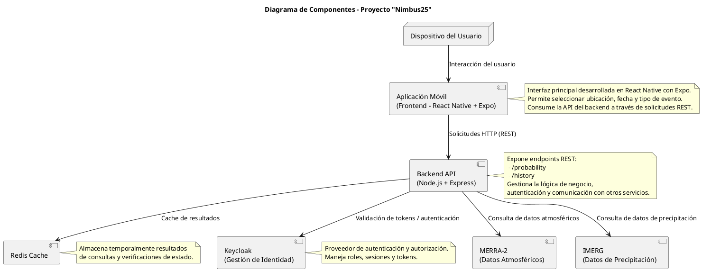

# 🧱 Componentes del Sistema – Proyecto Nimbus25  
### Desafío: *Will It Rain On My Parade?* – NASA Space Apps Challenge 2025

---

## 🧩 Propósito del documento

Describir la estructura interna del backend y los componentes principales que conforman el sistema Nimbus25, explicando su responsabilidad, dependencias y forma de interacción.

---

## 🧠 Visión general

El backend de Nimbus25 sigue un enfoque **monolito modular**, basado en los principios de **arquitectura hexagonal (puertos y adaptadores)**.  
Esto permite mantener la lógica de negocio independiente de los detalles técnicos y facilita la futura transición hacia una arquitectura de microservicios.

---

## 🧰 Módulos principales

| Módulo | Descripción | Ejemplos de funciones |
|--------|--------------|-----------------------|
| **API Layer** | Gestiona las solicitudes HTTP provenientes del frontend. Expone endpoints REST, valida parámetros y formatea las respuestas. | `/probability`, `/status`, `/health`, `/history` |
| **Domain Layer** | Contiene la lógica central del sistema: procesamiento, merge y cálculo estadístico. No depende de frameworks ni librerías externas. | `calcularProbabilidad()`, `mergearDatos()`, `generarMetricas()` |
| **NASA Adapter** | Se encarga de consultar las APIs de la NASA u otras fuentes, transformar los datos a un formato común y manejar errores o caídas de red. | `fetchPowerData()`, `fetchGesDiscData()` |

---

## 🧩 Diagrama de componentes

---

## 🔄 Flujo general de ejecución

1. El usuario envía una solicitud al **endpoint REST**.  
2. El **Backend** valida los parámetros y delega la solicitud a las **Apis de la NASA**.
5. Los datos se procesan, normalizan.
6. El resultado se devuelve al frontend junto con el estado del sistema y un `traceId`.

---

> *“Mantener las responsabilidades separadas hoy nos da flexibilidad para escalar mañana.”*  
> — Equipo Nimbus25