# 🧱 Componentes del Sistema – Proyecto Nimbus25  
### Desafío: *Will It Rain On My Parade?* – NASA Space Apps Challenge 2025

---

## 🧩 Propósito del documento

Describir la estructura interna del backend y los componentes principales que conforman el sistema Nimbus25, explicando su responsabilidad, dependencias y forma de interacción.

---

## 🧠 Visión general

El backend es un monolito modular en Node.js (Express) con arquitectura hexagonal (puertos y adaptadores). La lógica de negocio vive aislada de detalles de infraestructura (HTTP, OPeNDAP, cache, IAM). El frontend es React Native (Expo) que consume endpoints REST.

---

## 🧰 Módulos principales

| Módulo                             | Responsabilidad                                                                                                                  | Archivos/ubicación (relevantes)                                                                                             | Ejemplos de funciones                                                |
| ---------------------------------- | -------------------------------------------------------------------------------------------------------------------------------- | --------------------------------------------------------------------------------------------------------------------------- | -------------------------------------------------------------------- |
| **API Layer (REST)**               | Enruta y valida requests, arma respuestas                                                                      | `routes/*` , `services/weather/service.js` (como orquestador)                                            | `GET /probability`, `GET /status`, `GET /health`, `GET /history`     |
| **Weather Service (Core)**         | Orquesta el flujo: arma consulta, pide datos a adaptadores, normaliza, hace *merge* temporal/espacial y calcula métricas simples | `services/weather/service.js`, `services/weather/index.js`                                                                  | `getProbabilityFor(loc, date)`, `mergeSources()`, `computeMetrics()` |
| **Adapters NASA (Ports/Adapters)** | Obtienen datos y los devuelven en un formato común del dominio                                                            | `services/weather/merra/*`, `services/weather/imerg.js`                                                                     | `readMERRA()`, `readIMERG()`                                         |
| **OPeNDAP Client**                 | Cliente bajo nivel para Hyrax/OPeNDAP (HTTP + parsing ASCII/NC)                                                                  | `services/weather/opendap.js`, `services/weather/opendap-client.js`, `services/weather/http.js`, `services/weather/auth.js` | `fetchDDS/ASCII()`, `headOk()`, manejo de *retries*                  |
| **Parsing & Normalization**        | Parseo y normalización de payloads, grillas, variables y unidades                                                                | `services/weather/parsing.js`, `services/weather/grid.js`, `services/weather/variables.js`, `services/weather/urls.js`      | `parseAsciiArray()`, `buildGridIndex()`, `mapVariable('T2M')`        |
| **Climatología/Climo (opcional)**  | Soporte a valores climatológicos (misma fecha)                                                                  | `services/weather/climo.js`, `services/weather/merra/climo-sameday.js`                                                      | `readClimoSameDay()`                                                 |
| **Config**                         | Configuración centralizada, endpoints, timeouts, feature flags                                                                   | `services/weather/config.js`                                                                                                | `get('MERRA_BASE')`, `getTimeouts()`                                 |
| **Cache (Redis)**                  | Cache de resultados y *health checks*                                                                                            | Integrado desde API/Service hacia Redis                                                                                     | `cache.get/set(key)`, *TTL* por endpoint                             |
| **Observabilidad**                 | Logging estructurado y trazabilidad                                                                                              | `services/weather/logger.js`                                                                                                | `log.info({traceId,...})`                                            |

---

## Mapeo de archivos reales, responsabilidades

- **services/weather/service.js:** Orquestador del caso de uso /probability. Pide a MERRA-2/IMERG según parámetros, fusiona, calcula métricas (ej. probabilidad de precipitación, intensidad esperada) y devuelve DTO.

- **services/weather/index.js:** Punto de entrada del weather service (exporta funciones públicas del módulo).

- **services/weather/imerg.js:** Adapter GPM/IMERG. Resuelve URL/vars, consulta por OPeNDAP/HTTP y normaliza precipitación.

- **services/weather/merra/index.js:** Adapter MERRA-2. Coordina lectura de variables MERRA-2.

- **services/weather/merra/read-merra.js:** Lectura de variables puntuales vía OPeNDAP.

- **services/weather/merra/opendap-client.js:** Llamados de bajo nivel a OPeNDAP (Hyrax) para MERRA-2.

- **services/weather/merra/variables.js:** Catálogo/alias de variables MERRA-2 usadas por Nimbus25.

- **services/weather/merra/urls.js:** Construcción de endpoints OPeNDAP MERRA-2 por fecha/hora/granularidad.

- **services/weather/parsing.js:** Parsing de respuestas ASCII/DAP2/Hyrax a arrays y estructuras tabulares.

- **services/weather/grid.js:** Utilidades de grilla (ubicación índices/nearest neighbor, bounding box, etc.).

- **services/weather/opendap.js:** Cliente genérico OPeNDAP (comparte lógica para MERRA-2 e IMERG).

- **services/weather/http.js:** Wrapper HTTP, timeouts, retries y User-Agent.

- **services/weather/auth.js:** Manejo de credenciales/cookies/tokens si el servidor OPeNDAP lo requiere.

- **services/weather/climo.js y services/weather/merra/climo-sameday.js:** Lecturas climatológicas (misma fecha históricamente) para baselines.

- **services/weather/config.js:** Config del módulo (endpoints, timeouts, feature toggles).

- **services/weather/logger.js:** Logger (niveles).

- **services/weather/utils.js:** Utilidades comunes (fechas, redondeos, unidades, etc.).

## Datos y métricas (resumen)

### Fuentes:

*MERRA-2*: variables atmosféricas de superficie/10 m necesarias para contexto y ajuste (p.ej. temperatura T2M, humedad QV2M/RH si se deriva, viento U10M/V10M).

*GPM/IMERG*: precipitación (tasa/acumulado) a alta resolución temporal.

*Normalización*: conversión de unidades (K→°C, kg/kg→%, mm/hr→mm).

*Cálculos*: probabilidad de precipitación en ventana hours, intensidad esperada.

*Climo*: baseline del mismo día (histórico) para relativizar riesgo.

## 🧩 Diagrama de componentes

```plantuml
@startuml
title Diagrama de Componentes - Proyecto "Nimbus25"

' === NODOS PRINCIPALES ===
node "Dispositivo del Usuario" as USER

' === COMPONENTES ===
component "Aplicación Móvil\n(Frontend - React Native + Expo)" as MOBILE
component "Backend API\n(Node.js + Express)" as API
component "Redis Cache" as REDIS
component "MERRA-2\n(Datos Atmosféricos)" as MERRA2
component "IMERG\n(Datos de Precipitación)" as IMERG

' === NOTAS ===
note right of MOBILE
Interfaz principal desarrollada en React Native con Expo.
Permite seleccionar ubicación, fecha y tipo de evento.
Consume la API del backend a través de solicitudes REST.
end note

note right of API
Expone endpoints REST:
 
/probability
/history
Gestiona la lógica de negocio,
autenticación y comunicación con otros servicios.
end note

note right of REDIS
Almacena temporalmente resultados
de consultas y verificaciones de estado.
end note

' === RELACIONES ===
USER --> MOBILE : Interacción del usuario
MOBILE --> API : Solicitudes HTTP (REST)
API --> REDIS : Cache de resultados
API --> MERRA2 : Consulta de datos atmosféricos
API --> IMERG : Consulta de datos de precipitación

@enduml

```

---

## 🔄 Flujo general de ejecución

1. API valida parámetros

2. Weather Service arma la consulta (fuentes, variables, granularidad, zona).

3. Adapters (IMERG / MERRA-2) traen datos vía OPeNDAP/HTTP.

4. Parsing/Normalization limpian y unifican.

5. Weather Service hace merge temporal y calcula métricas.

6. Se guarda en Redis con TTL y se responde al frontend.

---

> *“Mantener las responsabilidades separadas hoy nos da flexibilidad para escalar mañana.”*  
> — Equipo Nimbus25
