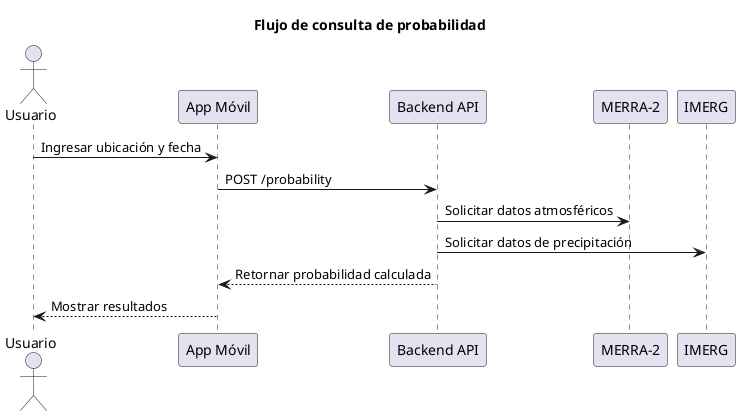

# 🔄 Flujos de Secuencia – Proyecto Nimbus25  
### Desafío: *Will It Rain On My Parade?* – NASA Space Apps Challenge 2025

---

## 🧩 Propósito del documento

Este documento describe los **flujos principales de interacción** dentro del sistema Nimbus25.  
Su objetivo es representar gráficamente cómo se comunican los distintos componentes (Frontend, Backend, Adapters y APIs NASA) durante los procesos clave.

---

## ☁️ Flujo 1: Consulta de probabilidad climática

Este flujo representa la operación más importante del sistema:  
**el usuario consulta la probabilidad para una ubicación y fecha dadas.**

---