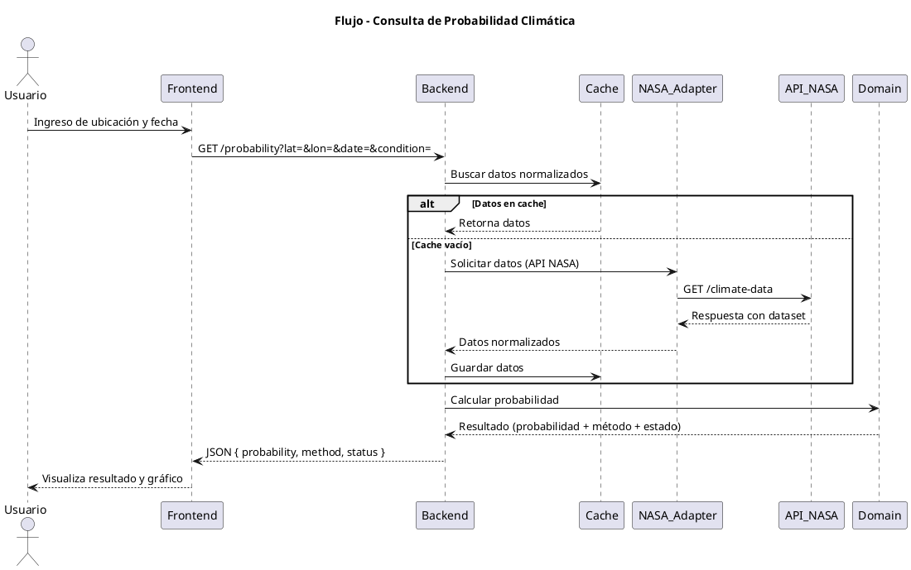
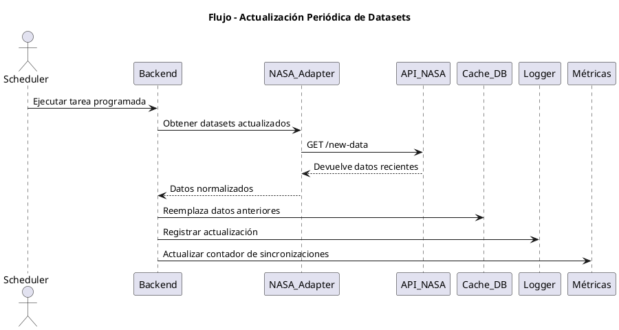
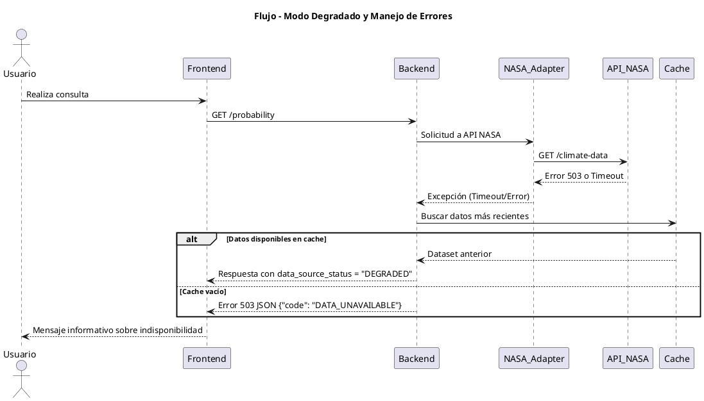

# 🔄 Flujos de Secuencia – Proyecto Nimbus25  
### Desafío: *Will It Rain On My Parade?* – NASA Space Apps Challenge 2025

---

## 🧩 Propósito del documento

Este documento describe los **flujos principales de interacción** dentro del sistema Nimbus25.  
Su objetivo es representar gráficamente cómo se comunican los distintos componentes (Frontend, Backend, Adapters y APIs NASA) durante los procesos clave.

---

## ☁️ Flujo 1: Consulta de probabilidad climática

Este flujo representa la operación más importante del sistema:  
**el usuario consulta la probabilidad de una condición extrema (lluvia, calor, viento, etc.) para una ubicación y fecha dadas.**

---

## 🔁 Flujo 2: Actualización periódica de datasets (opcional)

Representa una tarea automática (scheduler) que actualiza los datos disponibles para mejorar la precisión de futuras consultas.

---

## 🚨 Flujo 3: Manejo de errores y modo degradado

Este flujo muestra cómo el sistema responde cuando las APIs de la NASA no están disponibles o devuelven errores.

---

## 🧠 Resumen

| Flujo | Descripción | Resultado esperado |
|--------|--------------|--------------------|
| **1. Consulta de probabilidad** | Usuario obtiene la probabilidad de una condición extrema. | Respuesta rápida y visual. |
| **2. Actualización periódica** | Scheduler actualiza datasets y limpia cache. | Datos actualizados y precisos. |
| **3. Modo degradado** | APIs NASA caídas o lentas. Se usa cache o se notifica error. | Sistema resiliente y transparente. |

---

> *“Incluso cuando las APIs fallan, la predicción sigue disponible gracias al modo degradado.”*  
> — Equipo Nimbus25