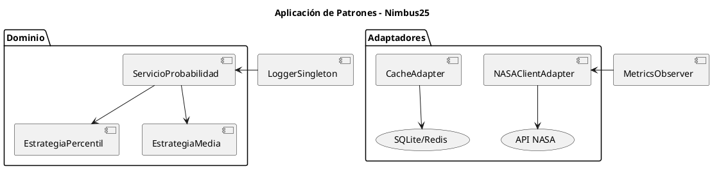

# 🧠 Patrones y Principios – Proyecto Nimbus25  
### Desafío: *Will It Rain On My Parade?* – NASA Space Apps Challenge 2025

---

## 🎯 Propósito del documento

Definir los **patrones de diseño y arquitectura** utilizados en el desarrollo de Nimbus25, así como los **principios técnicos y de buenas prácticas** que guían las decisiones del equipo.

---

## 🧩 Patrones de arquitectura aplicados

| Patrón | Descripción | Beneficio principal |
|--------|--------------|---------------------|
| **Hexagonal (Ports & Adapters)** | Divide la aplicación en núcleo de negocio (dominio) y adaptadores externos (API, DB, NASA). | Aísla la lógica del dominio, facilita pruebas y mantenimiento. |
| **Monolito modular** | Mantiene un único servicio con módulos bien definidos. | Reduce complejidad inicial y permite escalar gradualmente. |
| **Cache-Aside** | Busca datos en cache antes de ir a la fuente externa; si no existen, se guarda tras obtenerlos. | Mejora el rendimiento y reduce llamadas a APIs NASA. |
| **Circuit Breaker** | Desactiva temporalmente llamadas a servicios que fallan repetidamente. | Evita saturación del sistema ante fallas externas. |
| **Bulkhead** | Separa recursos (threads, conexiones) por componente. | Aísla fallos y mejora resiliencia. |
| **Retry con backoff exponencial** | Reintenta solicitudes fallidas con tiempos de espera crecientes. | Aumenta robustez frente a errores intermitentes. |
| **Observer (para métricas/logs)** | Los componentes notifican eventos a un sistema de observación. | Permite trazabilidad sin acoplar el dominio. |

---

## 🧱 Patrones de diseño (nivel de código)

| Patrón | Aplicación en Nimbus25 |
|--------|-------------------------|
| **Repository** | Abstrae el acceso a datos (cache o BD) y oculta detalles de almacenamiento. |
| **Strategy** | Permite cambiar el método de cálculo de probabilidad (percentil, media, modelo). |
| **Adapter** | Cada cliente NASA implementa su propio adaptador al formato común. |
| **Factory Method** | Crea instancias de clientes API según la fuente de datos. |
| **DTO (Data Transfer Object)** | Define objetos limpios entre capas API ↔ Dominio ↔ Adaptadores. |
| **Singleton (Logger / Metrics)** | Asegura una única instancia global de monitoreo y trazabilidad. |
| **Builder** | Facilita la construcción de requests complejos a APIs externas. |

---

## ⚙️ Principios técnicos adoptados

| Principio | Significado | Aplicación |
|------------|--------------|------------|
| **KISS (Keep It Simple, Stupid)** | Evitar sobreingeniería y priorizar claridad. | Código legible, modular y documentado. |
| **DRY (Don’t Repeat Yourself)** | Reutilizar lógica común en servicios o utilidades. | Unificación de funciones de manejo de datos. |
| **Separation of Concerns** | Cada módulo cumple un propósito único. | API, dominio y adaptadores aislados. |
| **Fail Fast** | Detectar errores temprano y registrar fallos. | Validaciones estrictas en capa API. |
| **YAGNI (You Ain’t Gonna Need It)** | No implementar funciones innecesarias. | Solo features imprescindibles en el MVP. |
| **12-Factor App (principios básicos)** | Código portable y configurable por entorno. | Variables de entorno `.env`, logs a stdout, configuración desacoplada. |

---

## 🔍 Ejemplo visual de aplicación de patrones

---

## 🧭 Buenas prácticas de implementación

1. **Validaciones estrictas** en endpoints: evitar requests inválidos o incompletos.  
2. **Trazabilidad completa:** cada request genera un `traceId`.  
3. **Logs estructurados:** formato JSON con timestamp, nivel y contexto.  
4. **Testing modular:** pruebas unitarias por módulo (API, dominio, adaptadores).  
5. **Configuración centralizada:** variables `.env` y defaults versionados.  
6. **Control de errores global:** middleware `errorHandler` con mensajes uniformes.  
7. **Código autodescriptivo:** nombres claros y consistentes entre capas.  
8. **Documentación viva:** actualizar diagramas y contratos junto al código.

---

> *“La arquitectura limpia no es un fin en sí mismo, sino una herramienta para mantener la claridad y la flexibilidad del proyecto.”*  
> — Equipo Nimbus25